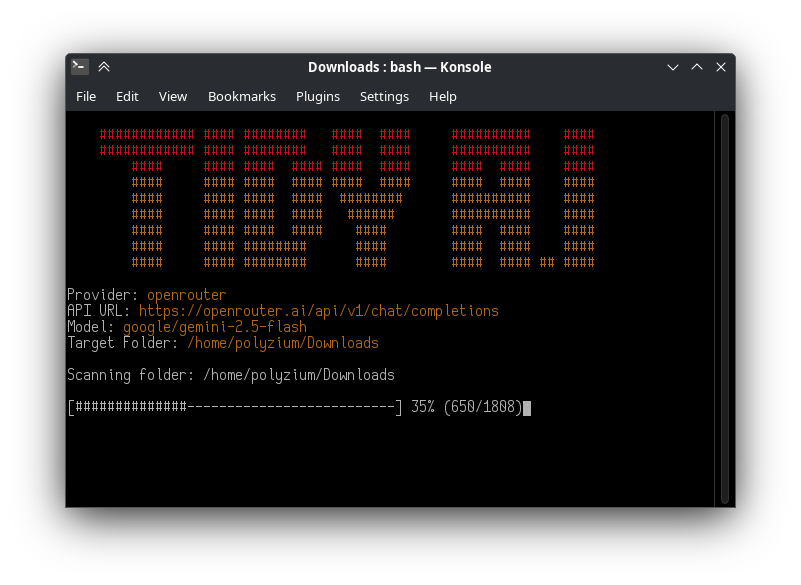

```
    ############ #### ########   ####  ####     ##########    ####
    ############ #### ########   ####  ####     ##########    ####
        ####     #### ####  #### ####  ####     ####  ####    ####
        ####     #### ####  #### ####  ####     ####  ####    ####
        ####     #### ####  ####  ########      ##########    ####
        ####     #### ####  ####   ######       ##########    ####
        ####     #### ####  ####    ####        ####  ####    ####
        ####     #### ########      ####        ####  ####    ####
        ####     #### ########      ####        ####  #### ## ####
```

<div align="center">

</div>

# AI-powered file organization for macOS & Linux

## Features
- 🤖 **AI-Powered** - Uses multiple AI providers to intelligently organize files
- 🌐 **Multi-Provider Support** - OpenAI, OpenRouter, Groq, Azure, and more
- 🐧 **Cross-Platform** - Works on macOS, Linux, and any Unix-like system
- 🛡️ **Safe** - Never renames/deletes files, only moves them into folders
- 🔄 **Undo System** - Easily revert organization with one command
- 📦 **Batch Processing** - Handles large folders by processing files in batches
- 💰 **Cost-Effective** - Uses efficient models like GPT-4o Mini and Gemini 2.5 Flash
- ⚡ **Pure Shell** - Only requires bash, curl, and jq - no complex dependencies

## 🎬 TidyAI in Action

<!-- <div align="center">

</div> -->
[TODO]

## Prerequisites

Before using TidyAI shell script, ensure you have the required dependencies:

### macOS
```bash
# Install via Homebrew
brew install jq curl

# curl is usually pre-installed on macOS
```

### Ubuntu/Debian
```bash
sudo apt-get update
sudo apt-get install -y jq curl
```

### Arch Linux
```bash
sudo pacman -S jq curl
```

### CentOS/RHEL/Fedora
```bash
# CentOS/RHEL
sudo yum install -y jq curl

# Fedora
sudo dnf install -y jq curl
```

## Installation

1. **Download the script:**
   ```bash
   wget https://raw.githubusercontent.com/geetbatth/tidyai/main/tidyai.sh
   chmod +x tidyai.sh
   ```

2. **Set up your API key:**
   ```bash
   # Preferred method (new variable)
   export TIDYAI_API_KEY="your-api-key-here"
   
   # Legacy method (still supported)
   export TidyAIOpenAIAPIKey="your-api-key-here"
   
   # Make it permanent by adding to your shell profile
   echo 'export TIDYAI_API_KEY="your-api-key-here"' >> ~/.bashrc
   # or ~/.zshrc for zsh users
   ```

3. **Get an API key:**
   - **OpenAI**: [platform.openai.com/api-keys](https://platform.openai.com/api-keys)
   - **OpenRouter**: [openrouter.ai](https://openrouter.ai)
   - **Groq**: [console.groq.com](https://console.groq.com)
   - **Other providers**: Check their respective documentation

## Usage

### Basic Usage
```bash
# Organize a folder with default settings (OpenAI)
./tidyai.sh ~/Downloads

# Organize with a specific provider
./tidyai.sh --provider openrouter ~/Documents
./tidyai.sh --provider groq ~/Desktop
```

### Provider Examples

#### OpenAI (Default)
```bash
export TIDYAI_API_KEY="sk-..."
./tidyai.sh --provider openai ~/Downloads
```

#### OpenRouter
```bash
export TIDYAI_API_KEY="sk-or-..."
./tidyai.sh --provider openrouter --model openrouter/gpt-4o-mini ~/Downloads
```

#### Groq
```bash
export TIDYAI_API_KEY="gsk_..."
./tidyai.sh --provider groq --model llama-3.1-70b-versatile ~/Downloads
```

#### Azure OpenAI
```bash
export TIDYAI_API_KEY="your-azure-key"
./tidyai.sh --provider azure \
  --api-base "https://your-resource.openai.azure.com" \
  --model "your-deployment-name" \
  ~/Downloads
```

#### Local AI (LM Studio)
```bash
# No API key needed for local models
./tidyai.sh --provider lmstudio \
  --api-base "http://localhost:1234" \
  --model "qwen2.5:7b" \
  ~/Downloads
```

### Advanced Configuration

#### Environment Variables
```bash
export TIDYAI_PROVIDER="openrouter"
export TIDYAI_API_BASE="https://openrouter.ai/api"
export TIDYAI_MODEL="openrouter/gpt-4o-mini"
export TIDYAI_API_KEY="your-key"

# Then simply run:
./tidyai.sh ~/Downloads
```

#### Command Line Options
```bash
./tidyai.sh --help  # Show all available options

# Custom API configuration
./tidyai.sh \
  --provider custom \
  --api-base "https://api.example.com" \
  --api-path "/v1/chat/completions" \
  --model "custom-model" \
  --api-key "your-key" \
  ~/folder-to-organize
```

## 🔄 Undo System
TidyAI includes a powerful undo system that makes organization completely safe and reversible:

### **How It Works**
- **Automatic Backup**: Before organizing, TidyAI saves your current folder structure to a hidden `.tidyai` file
- **Undo**: After organizing, TidyAI offers to undo if you dont like the result
- **Smart Detection**: When you run TidyAI on a previously organized folder, it detects the backup and offers to undo

## Supported AI Providers

| Provider | API Base | Notes |
|----------|----------|-------|
| **OpenAI** | `https://api.openai.com` | Default provider, most reliable |
| **OpenRouter** | `https://openrouter.ai/api` | Access to multiple models |
| **Groq** | `https://api.groq.com/openai` | Fast inference, free tier |
| **Fireworks** | `https://api.fireworks.ai/openai` | High-performance models |
| **Together** | `https://api.together.xyz` | Open-source models |
| **Perplexity** | `https://api.perplexity.ai` | Search-augmented models |
| **DeepSeek** | `https://api.deepseek.com` | Cost-effective Chinese provider |
| **Azure OpenAI** | `https://<resource>.openai.azure.com` | Enterprise-grade |
| **LM Studio** | `http://localhost:1234` | Local models |
| **LocalAI/vLLM** | `http://localhost:8000` | Self-hosted solutions |

## Troubleshooting

### Common Issues

**"command not found: jq"**  
Install jq for your system (see Prerequisites section)

**"Error: API key not configured!"**
```bash
# Set your API key
export TIDYAI_API_KEY="your-key-here"
```

**"permission denied: ./tidyai.sh"**
```bash
# Make script executable
chmod +x tidyai.sh
```

**"Empty response received from provider"**  
Check your API key and provider settings.  
Verify the provider is accessible from your network.

## Differences from Windows Version

The shell script version includes several enhancements over the original PowerShell version:

- ✅ **Multi-provider support** - Not limited to OpenAI
- ✅ **Local AI support** - Works with self-hosted models
- ✅ **Cross-platform compatibility** - Works on any Unix-like system
- ✅ **Flexible authentication** - Supports various auth schemes

## Contribute
Pull requests welcome!

---

**Shell Script Port by Polyzium**  
**Original Created by Geet**
